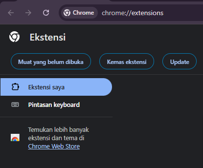

# Youtube Ad Block For Chrome

Ekstensi chrome ini digunakan untuk memblokir iklan di Youtube

## PENTING!
- Ekstensi ini adalah ekstensi sederhana dan mungkin tidak memblokir semua jenis iklan di YouTube.
- Penggunaan ekstensi pemblokir iklan mungkin melanggar kebijakan YouTube, jadi gunakan dengan bijak.

## Cara pasang:

- Download dan Ekstract File Ekstensi
- Buka Chrome dan Akses (chrome://extensions/)
- Aktifkan Mode Developer
- Bagian Kiri atas klik tombol "Load unpacked" dan pilih folder
 
- Ambil folder yang sudah di dwonload tadi

## Masalah 
- Iklan Youtube bersifat dinamis sehingga bisa saja berubah
- Muncul Layar Hitam saat memutar video selanjutnya
- Layar Hitam muncul dan masih menampilkan iklan
- solusi refresh Browser anda
